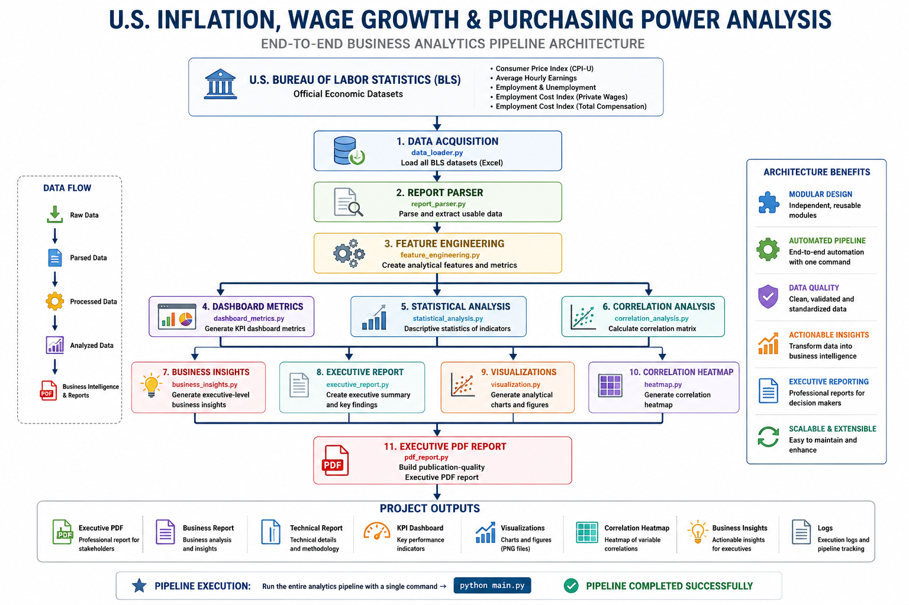
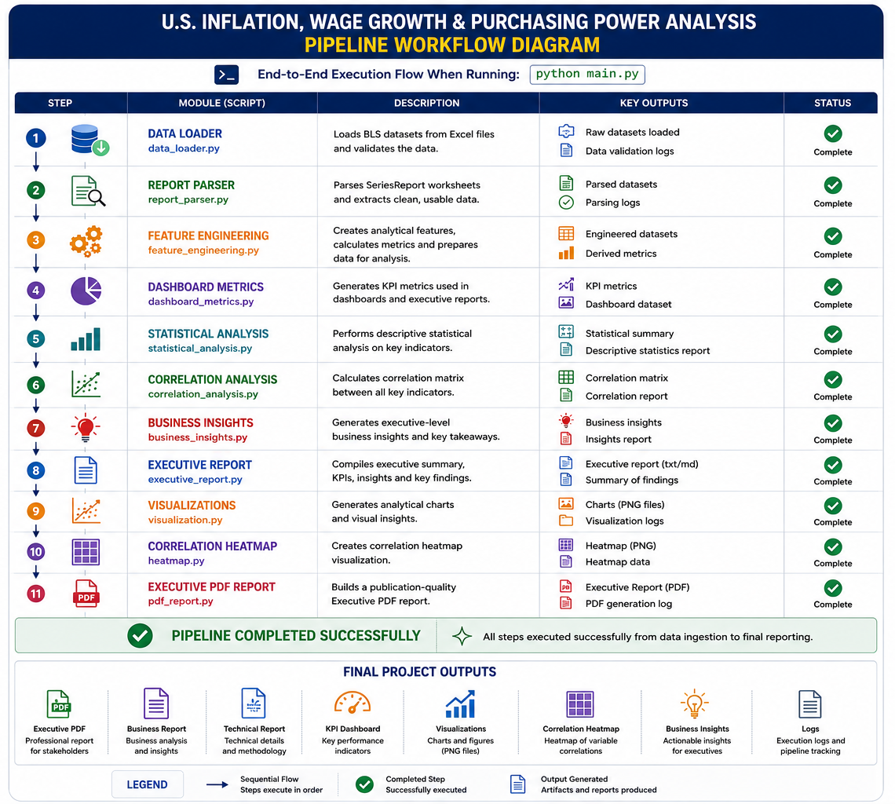
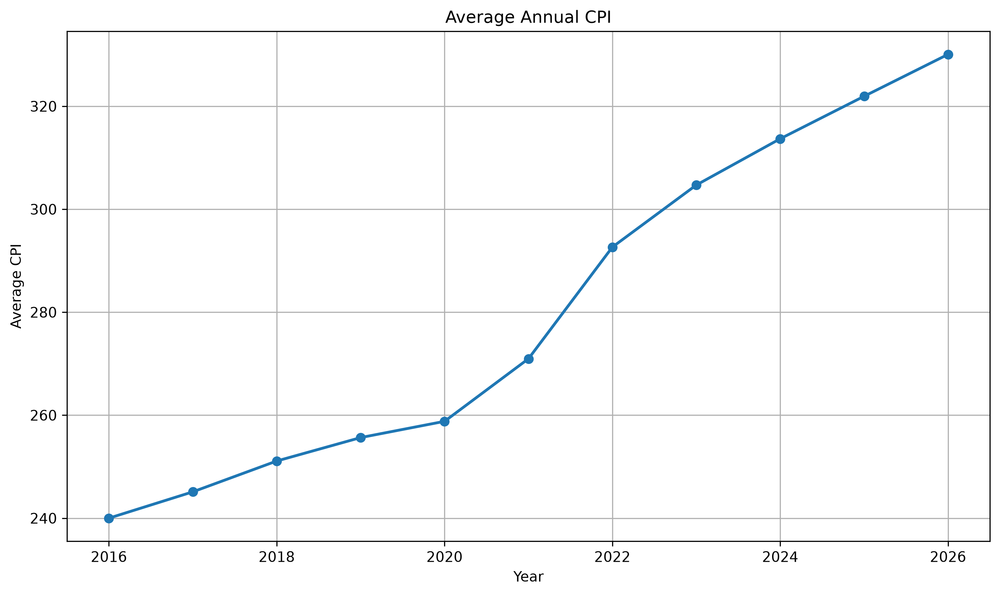
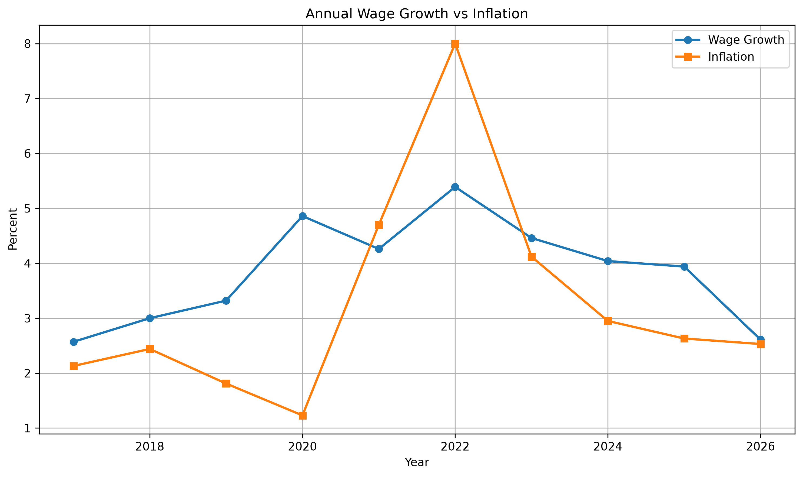
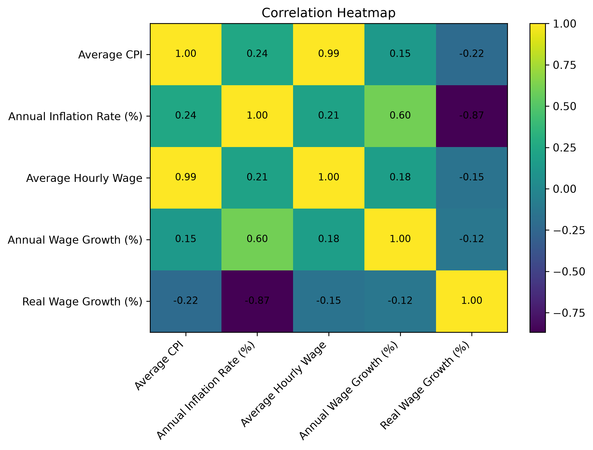

# 📈 U.S. Inflation, Wage Growth & Purchasing Power Analysis

### End-to-End Business Analytics Case Study using Python, SQL, Statistical Analysis, Data Visualization & Executive Reporting


---

## 📌 Project Highlights

| Feature | Details |
|----------|----------|
| Programming Language | Python 3.12 |
| Data Source | U.S. Bureau of Labor Statistics (BLS) |
| Official Datasets | 6 |
| Analytics Pipeline | Fully Automated |
| Statistical Analysis | Descriptive Statistics & Correlation |
| Business Insights | Automated |
| Executive Reporting | PDF Generation |
| Visualizations | 9+ Charts |
| Testing | Unit & Integration Tests |
| Architecture | Modular |
| Entry Point | `python main.py` |
| License | MIT |

---

## 🛠 Technology Stack

| Area | Technologies |
|------|--------------|
| Programming | Python |
| Analytics | Pandas |
| Visualization | Matplotlib |
| Reporting | ReportLab |
| Data Source | BLS |
| Version Control | Git & GitHub |
| IDE | VS Code / GitHub Codespaces |

---

# Table of Contents

- Project Overview
- Business Problem
- Project Objectives
- Project Highlights
- Technology Stack
- Project Architecture
- Pipeline Workflow
- Featured Visualizations
- Key Findings
- Data Sources
- Feature Engineering
- Statistical Analysis
- Business Insights
- Reports Generated
- Installation
- Running the Project
- Testing
- Skills Demonstrated
- Future Enhancements
- About the Author
- License

---

## Project Overview

This project is a comprehensive end-to-end Business Analytics case study that analyzes the relationship between inflation, wage growth, employment, unemployment, and purchasing power in the United States.

Using official data from the **U.S. Bureau of Labor Statistics (BLS)**, the project demonstrates how raw economic data can be transformed into meaningful business insights through data engineering, feature engineering, statistical analysis, visualization, and executive reporting.

The project follows a production-style analytics pipeline that automates the complete workflow from data ingestion to PDF report generation.

---

## Business Problem

Inflation directly affects consumers, businesses, and policymakers. While wages generally increase over time, they do not always keep pace with inflation.

This project answers questions such as:

- Are wages growing faster than inflation?
- Is purchasing power improving or declining?
- Which years experienced the highest inflation?
- Which years had the strongest wage growth?
- How has employment changed over time?
- What is the relationship between inflation and wage growth?

---

## Project Objectives

The primary objectives of this project are to:

- Build an end-to-end analytics pipeline using Python.
- Analyze inflation and wage trends using official BLS datasets.
- Measure changes in purchasing power using Real Wage Growth.
- Generate business insights for executive decision-making.
- Produce publication-quality visualizations and PDF reports.
- Demonstrate best practices in modular software development.

---

# Key Features

✔ Automated Data Loading
✔ Report Parsing
✔ Feature Engineering
✔ Statistical Analysis
✔ Correlation Analysis
✔ Business Insights Generation
✔ Dashboard KPI Creation
✔ Executive Report Generation
✔ Executive PDF Report
✔ Data Visualizations
✔ Correlation Heatmap
✔ Modular Project Architecture
✔ Logging
✔ Automated Testing

---

# Project Architecture

The project follows a modular analytics architecture.

<p align="center">
  <a href="images/architecture/analytics_pipeline_architecture.png">
    
  </a>
</p>

---

# Analytics Workflow

The pipeline is fully automated and can be executed with a single command:

```bash
python main.py
```

---

# Pipeline Workflow

The Pipeline Workflow illustrates the complete end-to-end execution sequence of the analytics pipeline. Starting with official U.S. Bureau of Labor Statistics (BLS) datasets, the pipeline automatically performs data ingestion, report parsing, feature engineering, statistical analysis, business insight generation, visualization creation, and executive report generation.

The entire workflow can be executed with a single command:

```bash
python main.py
```

Each stage produces intermediate analytical outputs that feed the next stage, ultimately generating publication-quality reports, visualizations, dashboard metrics, and executive insights.

<p align="center">
  <a href="images/workflow/pipeline_workflow_diagram.png">
    
  </a>
</p>

**Workflow Highlights**

- 📥 Automated loading of official BLS datasets
- 📄 Parsing and validation of economic reports
- ⚙️ Feature engineering and business metric calculations
- 📊 Dashboard KPI generation
- 📈 Statistical and correlation analysis
- 💡 Executive business insight generation
- 📉 Automated visualization creation
- 📝 Executive report generation
- 📕 Publication-quality PDF report creation
- ✅ Fully automated end-to-end analytics pipeline

---

# Featured Visualizations

The analytics pipeline automatically generates a collection of publication-quality charts that illustrate key economic trends and support the executive findings.

The visualizations below highlight three of the most important analyses produced by the project.

---

## 📈 Annual CPI Trend

The Consumer Price Index (CPI) measures changes in the average prices paid by consumers over time. This visualization illustrates the long-term inflation trend across the analysis period.

<p align="center">
  <a href="images/annual_average_cpi.png">
    
  </a>
</p>

---

## ⚖️ Inflation vs. Wage Growth

One of the primary objectives of this project is to compare wage growth with inflation. This visualization helps determine whether wages have kept pace with rising consumer prices over time.

<p align="center">
  <a href="images/inflation_vs_wage_growth.png">
    
  </a>
</p>

---

## 🔥 Correlation Heatmap

The correlation heatmap summarizes the relationships between key economic indicators, including inflation, wages, and purchasing power. It provides a statistical overview of how these variables move together.

<p align="center">
  <a href="images/correlation_heatmap.png">
    
  </a>
</p>

---

## Additional Visualizations

The project also generates the following charts automatically during pipeline execution:

- Annual Wage Trend
- Annual Inflation Rate
- Annual Wage Growth
- Real Wage Growth
- Employment Trend
- Unemployment Trend

All generated figures are stored in the `images/` directory.

---

# Key Findings

The analysis of official U.S. Bureau of Labor Statistics (BLS) data provides several important insights into the relationship between inflation, wages, employment, and purchasing power in the United States.

## Executive Summary

The project demonstrates how macroeconomic indicators can be transformed into actionable business intelligence through an automated analytics pipeline. By integrating inflation, wage, employment, and unemployment data, the analysis highlights the impact of inflation on real wages and purchasing power over time.

---

## Key Business Insights

### Inflation Trends

- Annual inflation rates fluctuated significantly during the analysis period.
- Periods of elevated inflation placed downward pressure on consumers' purchasing power.
- Inflation remained one of the primary drivers affecting real wage growth.

---

### Wage Growth

- Average hourly wages generally increased throughout the analysis period.
- Wage growth was not always sufficient to offset inflation.
- Nominal wage increases did not necessarily translate into higher purchasing power.

---

### Purchasing Power

- Real Wage Growth provides a more meaningful measure of economic well-being than nominal wage growth alone.
- Years with negative Real Wage Growth indicate that inflation outpaced wage increases.
- Years with positive Real Wage Growth indicate improvements in purchasing power.

---

### Labor Market

- Employment and unemployment trends provide additional context for interpreting wage growth.
- Strong labor markets often coincided with sustained wage growth.
- Employment indicators complement inflation and wage analysis when evaluating overall economic conditions.

---

### Statistical Analysis

The project automatically performs statistical analysis including:

- Descriptive statistics
- Correlation analysis
- Feature engineering
- Business KPI generation

These analyses provide quantitative support for executive decision-making.

---

## Business Value

This project demonstrates how publicly available economic data can be transformed into decision-ready information for:

- Business Executives
- Financial Analysts
- Business Intelligence Teams
- Data Analysts
- Economists
- Policy Analysts

The automated pipeline reduces manual analysis while producing consistent, repeatable, and publication-quality analytical outputs.

---

# Repository Structure

```text
U.S.-Inflation-Wage-Growth-Purchasing-Power-Analysis
│
├── data/
│   ├── raw/
│   ├── interim/
│   ├── processed/
│   └── external/
│
├── docs/
│
├── images/
│   ├── architecture/
│   ├── charts/
│   └── dashboards/
│
├── logs/
│
├── notebooks/
│
├── reports/
│   ├── figures/
│   ├── tables/
│   ├── executive_report/
│   ├── Executive_Report.pdf
│   └── Technical_Report.pdf
│
├── scripts/
│
├── sql/
│
├── src/
│
├── tests/
│
├── main.py
├── README.md
├── requirements.txt
├── environment.yml
├── pyproject.toml
└── LICENSE
```

---

# Project Modules

| Module | Purpose |
|---------|---------|
| `data_loader.py` | Loads all BLS datasets |
| `report_parser.py` | Extracts usable data from BLS reports |
| `feature_engineering.py` | Creates engineered business metrics |
| `dashboard_metrics.py` | Produces KPI dashboard metrics |
| `statistical_analysis.py` | Generates descriptive statistics |
| `correlation_analysis.py` | Calculates correlation matrix |
| `business_insights.py` | Produces executive business insights |
| `executive_report.py` | Creates executive summary |
| `pdf_report.py` | Builds Executive PDF Report |
| `visualization.py` | Creates analytical charts |
| `heatmap.py` | Generates correlation heatmap |
| `logger.py` | Centralized logging |
| `config.py` | Project configuration |

---

# Systems Engineering Features

The project follows several systems engineering best practices:

- Modular architecture
- Separation of concerns
- Reusable functions
- Centralized configuration
- Logging throughout the pipeline
- Automated testing
- Clear folder organization
- End-to-end pipeline orchestration
- Git version control
- Production-style project structure

---

# Data Sources

This project uses official datasets published by the **U.S. Bureau of Labor Statistics (BLS)**.

| Dataset | BLS Series | Purpose |
|----------|------------|----------|
| Consumer Price Index (CPI-U) | CUUR0000SA0 | Measure inflation |
| Average Hourly Earnings | CES0500000003 | Measure wage growth |
| Total Nonfarm Employment | CES0000000001 | Employment trends |
| Unemployment Rate | LNS14000000 | Labor market analysis |
| Employment Cost Index (Private Wages) | CIU2020000000000A | Compensation analysis |
| Employment Cost Index (Total Compensation) | CIU2010000000000A | Benefits analysis |

---

# Data Processing Pipeline

The project automatically performs the following tasks:

1. Load official BLS datasets
2. Parse BLS formatted reports
3. Clean and standardize data
4. Engineer analytical features
5. Calculate annual metrics
6. Generate dashboard KPIs
7. Perform statistical analysis
8. Calculate correlations
9. Generate executive business insights
10. Produce visualizations
11. Create executive PDF reports

---

# Feature Engineering

The following business metrics are calculated automatically.

| Feature | Description |
|----------|-------------|
| Average CPI | Annual average Consumer Price Index |
| Annual Inflation Rate | Year-over-Year CPI growth |
| Average Hourly Wage | Annual average hourly earnings |
| Annual Wage Growth | Year-over-Year wage growth |
| Real Wage Growth | Wage growth adjusted for inflation |
| Average Employment | Annual employment |
| Average Unemployment Rate | Annual unemployment rate |

---

# Statistical Analysis

The pipeline automatically computes descriptive statistics including:

- Mean
- Median
- Standard Deviation
- Minimum
- Maximum
- Count

These statistics help summarize the economic indicators over the analysis period.

---

# Correlation Analysis

The project evaluates relationships between key economic indicators.

Variables included:

- Average CPI
- Inflation Rate
- Average Hourly Wage
- Wage Growth
- Real Wage Growth

The resulting correlation matrix is visualized as a heatmap.

---

# Business Insights Generated

The analytics pipeline automatically generates executive-level insights.

Examples include:

- Latest economic conditions
- Highest inflation year
- Highest wage growth year
- Lowest real wage growth year
- Average inflation
- Average wage growth
- Purchasing power trend
- Executive recommendations

These insights are used in both the Executive Report and Executive PDF.

---

# Reports Generated

The project automatically creates several reports.

| Report | Description |
|---------|-------------|
| Executive Report | Executive summary of findings |
| Executive PDF | Professional PDF for stakeholders |
| Business Report | Business analytics report |
| Technical Report | Technical implementation details |
| Data Profile Report | Data quality and profiling information |

All reports are generated automatically during pipeline execution.

---

# Executive Deliverables

Upon completion, the project automatically produces:

- Executive PDF Report
- Executive Summary
- Business Report
- Technical Report
- Dashboard KPIs
- Statistical Analysis
- Business Insights
- Publication-quality charts
- Correlation Heatmap

These deliverables demonstrate how raw economic data can be transformed into actionable business intelligence for executives, analysts, and decision-makers.

---

# Installation

## Clone the Repository

```bash
git clone https://github.com/<your-github-username>/U.S.-Inflation-Wage-Growth-Purchasing-Power-Analysis-An-End-to-End-Business-Analytics-Case-Study.git

cd U.S.-Inflation-Wage-Growth-Purchasing-Power-Analysis-An-End-to-End-Business-Analytics-Case-Study
```

---

## Create a Virtual Environment

### Windows

```bash
python -m venv .venv

.venv\Scripts\activate
```

### macOS / Linux

```bash
python3 -m venv .venv

source .venv/bin/activate
```

---

## Install Dependencies

Using pip

```bash
pip install -r requirements.txt
```

or using Conda

```bash
conda env create -f environment.yml

conda activate inflation-analysis
```

---

# Running the Project

The entire analytics pipeline can be executed using a single command.

```bash
python main.py
```

The pipeline performs the following tasks automatically:

- Load BLS datasets
- Parse reports
- Feature engineering
- Employment analysis
- Dashboard KPI generation
- Statistical analysis
- Correlation analysis
- Business insight generation
- Visualization creation
- Correlation heatmap generation
- Executive report generation
- Executive PDF generation

---

# Running Individual Tests

The project contains unit and integration tests for each major module.

Examples:

```bash
python -m tests.test_data_loader

python -m tests.test_features

python -m tests.test_statistics

python -m tests.test_business_insights

python -m tests.test_dashboard_metrics

python -m tests.test_visualization

python -m tests.test_pdf_report
```

---

# Project Outputs

Running the pipeline automatically generates:

## Reports

- Executive Report
- Executive PDF
- Business Report
- Technical Report
- Data Profile Report

Stored in:

```text
reports/
```

## Charts

Generated visualizations include:

- Annual CPI Trend
- Wage Trend
- Inflation Trend
- Wage Growth Trend
- Inflation vs Wage Growth
- Real Wage Growth
- Employment Trend
- Unemployment Trend
- Correlation Heatmap

Stored in:

```text
images/
```

## Logs

Complete execution logs are written to:

```text
logs/project.log
```

---

# Skills Demonstrated

This project demonstrates practical experience with:

### Programming

- Python

### Data Engineering

- ETL Pipelines
- Data Cleaning
- Feature Engineering

### Data Analytics

- Statistical Analysis
- Business Analytics
- KPI Development

### Data Visualization

- Matplotlib
- Correlation Analysis

### Reporting

- Executive Reporting
- PDF Generation

### Systems Engineering

- Modular Design
- Logging
- Automated Testing
- Git Version Control

### Business Intelligence

- Dashboard Metrics
- Business Insights
- Decision Support

---

# Future Enhancements

Potential improvements include:

- Integration with the BLS Public API
- Automated scheduled data refresh
- Interactive Power BI Dashboard
- Interactive Tableau Dashboard
- Streamlit web application
- Docker containerization
- CI/CD using GitHub Actions
- Cloud deployment (AWS, Azure, or GCP)
- Time-series forecasting
- Machine Learning models for inflation prediction
- Interactive executive dashboard
- REST API for analytics

---

# About the Author

## Monisha Sharma

Information Systems — Business Intelligence & Analytics

- Graduate Student of M.S. Analytics (Computational Analytics)
- Graduated in M.S. Information Systems (Business Intelligence)

Specializing in:

- Business Intelligence
- Data Analytics
- Data Engineering
- Data Governance
- SQL
- Python
- BI Tools & Technologies
- Cloud Analytics

This project was developed as a comprehensive end-to-end portfolio demonstrating modern analytics, data engineering, statistical analysis, visualization, and executive reporting using official U.S. Bureau of Labor Statistics data.

---

# Acknowledgments

Data provided by:

**U.S. Bureau of Labor Statistics (BLS)**

https://www.bls.gov

Economic indicators sourced from publicly available BLS datasets.

---

# License

This project is licensed under the MIT License.

See the LICENSE file for additional information.

---

# Repository Status

> **Version:** 1.0.0

**Project Status:** Complete

**Pipeline Status:** Fully Automated

**Tests:** Passing

**Documentation:** Complete

**Reports:** Automated

**Visualizations:** Automated

**Executive Reporting:** Automated

---
# Repository Statistics

| Metric | Value |
|---------|------:|
| Python Modules | 16 |
| Test Modules | 19 |
| SQL Scripts | 3 |
| Notebooks | 6 |
| Reports Generated | 4 |
| Visualizations | 9 |
| Architecture Diagrams | 2 |
| Lines of Python Code | 4,000+ |
| End-to-End Pipeline | Yes |
---

# Contact

If you have questions, suggestions, or would like to collaborate, feel free to connect.

⭐ If you found this project useful, please consider starring the repository.

---

## Thank You!

Thank you for taking the time to explore this project.

I hope it provides a useful example of how data engineering, analytics, statistics, visualization, and business reporting can be combined into a complete end-to-end business analytics solution.

---
